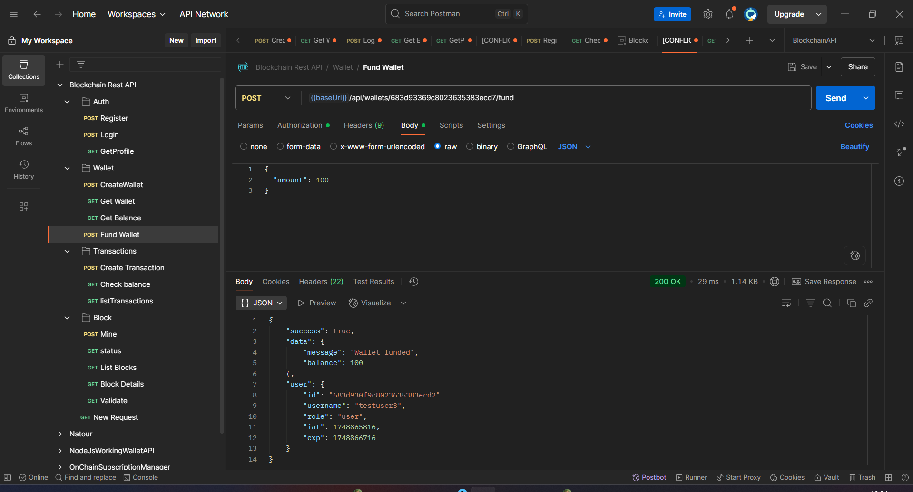

# Blockchain REST API

A robust and secure REST API for managing blockchain transactions, wallets, and user authentication. This API provides a complete solution for blockchain operations including wallet management, transaction processing, and block mining.


## 🚀 Features

- 🔐 Secure Authentication & Authorization
- 💼 Wallet Management
- 💰 Transaction Processing
- ⛏️ Block Mining
- 📊 Balance Checking
- 🔍 Transaction History
- 🛡️ Rate Limiting & Security Features

## 🛠️ Tech Stack

- Node.js & Express.js
- MongoDB with Mongoose
- JWT Authentication
- Crypto-js for Blockchain Operations
- Jest for Testing
- Joi for Request Validation
- Helmet for Security
- Express Rate Limiter

## 📋 Prerequisites

- Node.js (v14 or higher)
- MongoDB
- npm or yarn

## 🔧 Installation

1. Clone the repository:
```bash
git clone <repository-url>
cd blockchain-rest-api
```

2. Install dependencies:
```bash
npm install
```

3. Create a `.env` file in the root directory with the following variables:
```env
MONGODB_URI=your_mongodb_uri
JWT_SECRET=your_jwt_secret
JWT_REFRESH_SECRET=your_refresh_token_secret
PORT=3000
```

4. Start the server:
```bash
npm start
```

## 📚 API Documentation

### Authentication

#### Register User

```http
POST /api/auth/register
Content-Type: application/json

{
    "username": "string",
    "email": "string",
    "password": "string"
}
```

#### Login

```http
POST /api/auth/login
Content-Type: application/json

{
    "email": "string",
    "password": "string"
}
```

### Wallet Operations

#### Create Wallet

```http
POST /api/wallets
Authorization: Bearer <token>
Content-Type: application/json

{
    "metadata": {
        "name": "string",
        "description": "string"
    }
}
```

#### Get Wallet

```http
GET /api/wallets/:address
Authorization: Bearer <token>
```

#### Get Balance

```http
GET /api/wallets/:address/balance
Authorization: Bearer <token>
```

#### Fund Wallet

```http
POST /api/wallets/:address/fund
Authorization: Bearer <token>
Content-Type: application/json

{
    "amount": number
}
```

### Transaction Operations

#### Create Transaction

```http
POST /api/transactions
Authorization: Bearer <token>
Content-Type: application/json

{
    "from": "string",
    "to": "string",
    "amount": number
}
```

#### List Transactions

```http
GET /api/transactions
Authorization: Bearer <token>
```

#### Check Balance

```http
GET /api/transactions/balance/:address
Authorization: Bearer <token>
```

### Block Operations

#### Mine Block

```http
POST /api/blocks/mine
Authorization: Bearer <token>
```

#### Block Status

```http
GET /api/blocks/status
Authorization: Bearer <token>
```

#### List Blocks

```http
GET /api/blocks
Authorization: Bearer <token>
```

#### Validate Block

```http
POST /api/blocks/validate
Authorization: Bearer <token>
Content-Type: application/json

{
    "blockHash": "string"
}
```

## 🗄️ Database Schema

### User Schema
```javascript
{
    _id: ObjectId,
    username: String,
    email: String,
    password: String,
    role: String,
    profile: Object,
    refreshTokens: Array,
    isActive: Boolean,
    createdAt: Date,
    updatedAt: Date
}
```

### Wallet Schema
```javascript
{
    _id: ObjectId,
    userId: ObjectId,
    address: String,
    publicKey: String,
    privateKey: String,
    balance: Number,
    metadata: Object,
    createdAt: Date,
    updatedAt: Date
}
```

## 🧪 Testing

Run the test suite:
```bash
npm test
```

## 🔒 Security Features

- JWT-based authentication
- Password hashing with bcrypt
- Rate limiting
- Helmet security headers
- Input validation with Joi
- CORS protection

## 📝 License

This project is licensed under the ISC License.

## 👥 Contributing

1. Fork the repository
2. Create your feature branch (`git checkout -b feature/AmazingFeature`)
3. Commit your changes (`git commit -m 'Add some AmazingFeature'`)
4. Push to the branch (`git push origin feature/AmazingFeature`)
5. Open a Pull Request
